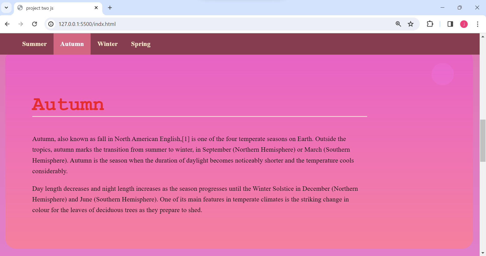

# Udacity | Landing Page Project

### In This Project We Are Converting A Static Landing Page Into A Dynamic One With The Help Of Javascript.

## Table of Contents:

-   [Project Title](#Udacity-|-Landing-Page-Project).

-   [Table of contents](#table-of-contents).

-   [Page Preview](#page-preview).

-   [Installation & Usage](#installation-and-usage).

-   [Development](#development).

-   [Contribute](#contribute).

-   [License & Copyright](#License-&-Copyright).

---

## Page Preview

---

[(Back to top)](#table-of-contents)

The project is ready as a zip file that you can download and open e.g.(VS Code).

---

## Development

[(Back to top)](#table-of-contents).

>
>**_JS Version: ES2015/ES6._**
>
>**_JS Standard: ESlint_**
>

### **The Project Contains Four Files :**

#### *css /*

-   *styles.css*

#### *index.html*

#### *js /*

-   *app.js*

#### *README.md*

#### **Each file contains it's modifications and comment above some step.**

-   In CSS Style changes were made to the project to be responsive to all types of screens.

-  There are 4 sections added to the HTML file.

-  There are a lot of things being done on app.js :

 1. Use goToSection() method to scroll to anchor ID using scrollIntoView event.

 2. Build NavBar Using navBuilder() function that executed by foreach loop and other helping methods like createMenuLink() to create elements and insert text to it and also appending.

 3. use isInViewport() method to identify which section is on the viewport to help the isActive() method to give a special class to the sectoin and button in the NavBar to be clearly viewed to the user that this is the actual section he selected.

 4. Toggle the Navbar Visibility according to user interaction with a webpage by checking if he is scrolling or not using the setTimeOut Method.

---

# Contribute

[(Back to top)](#table-of-contents)

**- EgFWD**

**- ITIDA**

**- Udacity**

---

# License & Copyright

[(Back to top)](#table-of-contents)

_© zainab